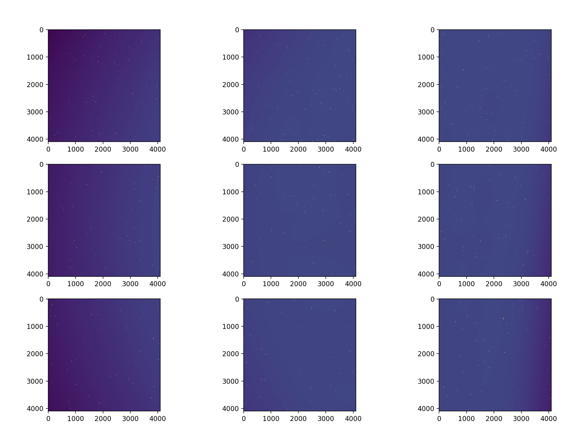

# A UVEX Image Simulator in Rust

The following provides a walk through of how to set up and run the simulator.


# Configuring the Details

We first make a configuration file for the instrument which contains paths to all the data files to be used. We do this by first generating a default configuration file and then editing it as needed.

```rust
fn main() {
    //Generate a default configuration file
    let configuration = UVEXConfiguration::default();
    //write this configuration file to config.yaml
    configuration.to_yaml("config.yaml");
}
```


Viewing the config.yaml file which hs just been created, we get the following:


```yaml

fuv_contamination:
  - Off
  - /Users/mayabasu/Desktop/uvex/spectral_response/UVIM_FUV_contamination.dat
nuv_contamination:
  - Off
  - /Users/mayabasu/Desktop/uvex/spectral_response/UVIM_NUV_contamination.dat
fuv_response:
  - Off
  - /Users/mayabasu/Desktop/uvex/spectral_response/UVIM_FUV_filter_response.dat
nuv_response:
  - Off
  - /Users/mayabasu/Desktop/uvex/spectral_response/UVIM_NUV_filter_response.dat
nuv_qe_response:
  - Off
  - /Users/mayabasu/Desktop/uvex/spectral_response/UVIM_NUV_QE.dat
dichroic:
  - Off
  - /Users/mayabasu/Desktop/uvex/spectral_response/UVIM_dichroic_response.dat
mirror_response:
  - Off
  - /Users/mayabasu/Desktop/uvex/spectral_response/mirror_reflectivity.dat
fuv_psf:
  - Off
  - /Users/mayabasu/Desktop/uvex/FUV_PSF
  - ~/Desktop/uvex/FUV_PSF_BLURRED
nuv_psf:
  - Off
  - /Users/mayabasu/Desktop/uvex/NUV_PSF
  - ~/Desktop/uvex/NUV_PSF_BLURRED
fuv_flatfield_illumination:
  - Off
  - /Users/mayabasu/Desktop/uvex/vinietting/FUV_vignetting_model_4096.fits
nuv_flatfield_illumination:
  - Off
  - /Users/mayabasu/Desktop/uvex/vinietting/NUV_vignetting_model_4096.fits
fuv_read_noise:
  - Off
  - /Users/mayabasu/Desktop/uvex/detector_effects/fuv_read_noise
nuv_read_noise:
  - Off
  - /Users/mayabasu/Desktop/uvex/detector_effects/nuv_read_noise
fuv_dark_current:
  - Off
  - /Users/mayabasu/Desktop/uvex/detector_effects/fuv_dark_current
nuv_dark_current:
  - Off
  - /Users/mayabasu/Desktop/uvex/detector_effects/nuv_dark_current
fuv_dead_pixels:
  - Off
  - /Users/mayabasu/Desktop/uvex/detector_effects/fuv_dead_pixels
nuv_dead_pixels:
  - Off
  - /Users/mayabasu/Desktop/uvex/detector_effects/nuv_dead_pixels
x_gap: 0.0
y_gap: 0.0
gaussian_blur_std:
  - Off
  - 20.0
read_noise:
  - Off
  - 2.0
  - 1.0
dark_current:
  - Off
  - 0.01
  - 0.005
dead_pixels:
  - Off
  - 100
  - 10
  - 10
  - 5


```
The default paths are for macOS, and assume that the uvex data is stored in a folder on your Desktop called "uvex", with the following file tree:

```text

uvex/
├── FUV_PSF/
│   ├── UVEX_FUV_PSF_1um_F001.fits
│   ├── UVEX_FUV_PSF_1um_F002.fits
│   └── etc...
├── NUV_PSF/
│   ├── UVEX_NUV_PSF_1um_F001.fits
│   ├── UVEX_NUV_PSF_1um_F002.fits
│   └── etc...
├── FUV_PSF_BLURRED
├── NUV_PSF_BLURRED
├── spectral_response/
│   ├── mirror_reflectivity.dat
│   ├── UVIM_dichroic_response.dat
│   ├── UVIM_FUV_contamination.dat
│   ├── UVIM_FUV_filter_response.dat
│   ├── UVIM_NUV_contamination.dat
│   ├── UVIM_NUV_filter_response.dat
│   └── UVIM_NUV_QE.dat
├── vinietting/
│   ├── FUV_vignetting_model_4096.fits
│   └── NUV_vignetting_model_4096.fits
└── detector_effects/
    ├── fuv_read_noise
    ├── nuv_read_noise
    ├── fuv_dark_current
    ├── nuv_dark_current
    ├── fuv_dead_pixels
    └── nuv_dead_pixels

```


If you do not want to have your data stored in this structure or have different file names, simply change each path in the configuration file to point appropriatly. FUV_PSF_BLURRED and NUV_PSF_BLURRED are empty directories which will be filled with psf files after the original psf files (in FUV_PSF and NUV_PSF) have been convolved with a gaussian.

The directories in detector_effects (fuv_read_noise, nuv_dark current, etc) as also empty. When there is experimental data for these effects, there will be 9 files in each of these directories, one for each detector plane. However, at the moment, we will be populating them with synthetic data.

If you have modified the configuration file, we will load in this new configuration to use instead of the default configuration. This configuration will be used to generate synthetic data for the dark current, dead pixel, and read noise maps which will be placed into the appropriate paths you specified in the configuration file.

```rust
fn main(){
    //Delete code which generates the default configuration file - after you modify this code to point to files on your own computer we will load in the modified configuration file.
    let configuration = UVEXConfiguration::from_yaml("config.yaml");
    //Generate 9 fits files, one per detector plane, for dark current, read noise, and dead pixel maps.
    UVEX::generate_missing_data(configuration)
}
```


# Detector Effects

First we will run the instrument with no sources and a constant background to see the effect of turning on or off detector effects

```rust
fn main(){
    let configuration = UVEXConfiguration::from_yaml("config.yaml");
    let mut uvex = UVEX::initialize(configuration);
    uvex.run((10.0,10.0),FullSpectrumSourceList::new_empty(0));


}

```
The read noise only effect gives random gaussian distributed noise. The dark current effect is exactly the same. This file happend to have an average of 10.0100011840813 and a std of 
0.005001332952679914, with expected values of 10.01 and 0.005 respectively.


If we add in the dead pixel map, then a random assortment of dead lines, pixels, and rectangles will be added to the images.

You can change the number of pixels, lines, and rectangles in the configuration file.


# Sources

The UVEX instrument takes a source_list, which is a group of point_sources. We can either add custom point_sources to an empty source_list, or we can initialize a random source list to look at. Let us try this later method first:


```rust
fn main() {

    let configuration = UVEXConfiguration::from_yaml("config.yaml");
    let mut uvex = UVEX::initialize(configuration);
    
    //create a spectrum which is a flat AB magnitude that will be shared by all point sources
    let spectrum = PowerSpectrum::flat_AB(20.0,STANDARD_SPECTRAL_GRID,"Input Spectrum");
    //create a randomly distributed point source field
    let source_list = FullSpectrumSourceList::full_spectrum_point_source_field(
        10000, //number of sources
        100.0,  //minimum multaplicative factor on brightness
        1000.0,  //maximum multaplicative factor on brightness
        spectrum, //Spectrum of sources
        &uvex.detector_array.detectors[0].grid //Where to populate these point sources? Detector 0
    );
    uvex.run((10.0,10.0),source_list); 


}


```

Now our output image contains 10,000 point sources as well:


If we turn on vinietting we can plot all 9 detector plane images in python to see the pattern:




Finally, all effects together:

