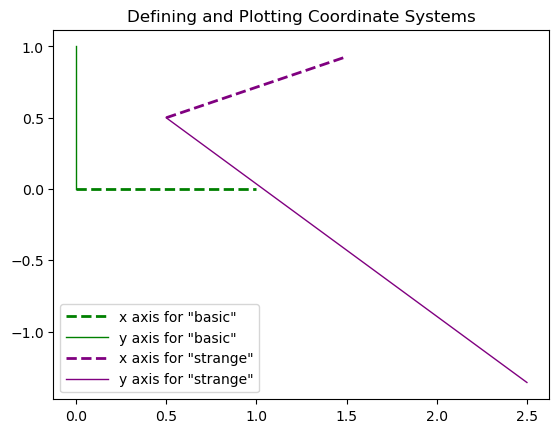
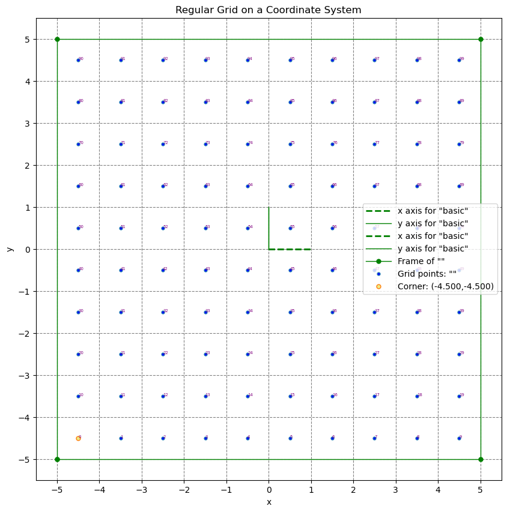
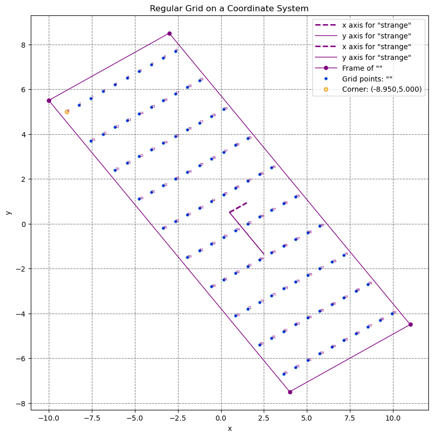
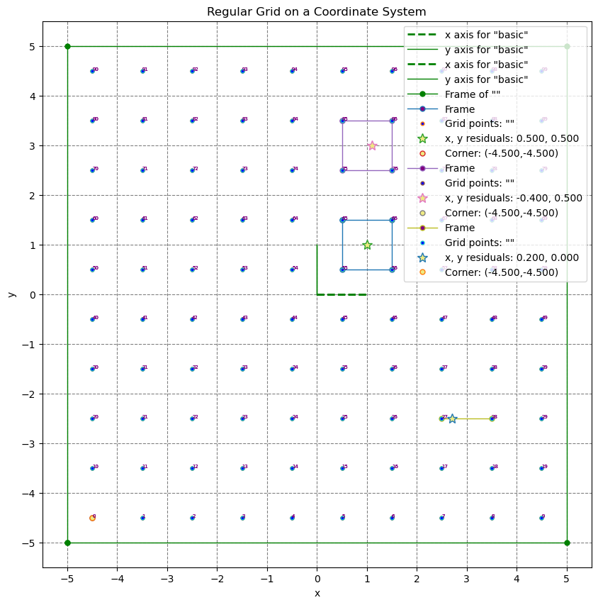
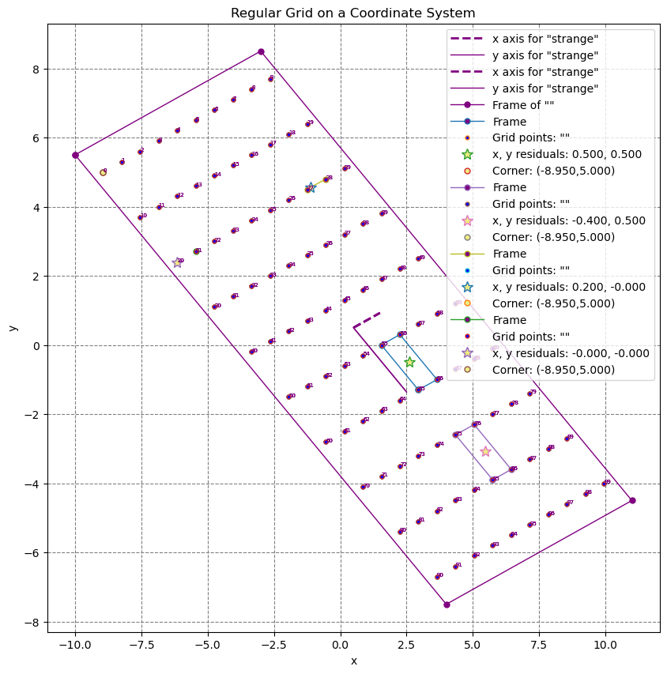

# Test Notebook
This is a notebook generated by the generate_test_notebook command in notebook.rs. In this file we will run through tests of astroimsim-geometry, astroimsim-spectra, astroimsim-data, and astroimsim-uvex
## Tests of astroimsim-geometry
The astroimsim-geometry crate handles coordinate systems and regular grids on those coordinate systems. 
We define two coordinate systems and then plot their axis as follows:
```rust
    let mut plot = Plot::new();
    let grid1 = GRID2D::new_empty((10,10), (1.0,1.0), (0.0,0.0),0.001, Coordinates::RELATIVE(coords1.clone()));
    coords1.plot(&mut plot,"green");
    grid1.plot_outline(&mut plot,"green");
    grid1.plot_points(&mut plot, PlotPoint::No);
    plot.set_title("Regular Grid on a Coordinate System");
    plot.legend();
    plot.save("tests/grid1_test").expect("could not save figure");
```

Now that we have coordinate systems defined, we can create regular grids with respect to these axis.
```rust let mut plot = Plot::new();
    let grid1 = GRID2D::new_empty((10,10), (1.0,1.0), (0.0,0.0),0.001, Coordinates::RELATIVE(coords1.clone()));
    coords1.plot(&mut plot,"green");
    grid1.plot_outline(&mut plot,"green");
    grid1.plot_points(&mut plot, PlotPoint::No);
    plot.set_title("Regular Grid on a Coordinate System");
    plot.legend();
    plot.save("tests/grid1_test").expect("could not save figure");
```


The yellow dot marks the corner, the 0th grid point. In general, we may have data given on a grid and need to interpolate the data to a value which is not a grid point. To do this, we need to find the nearest neibhors of a point in the grid. We visualize this by placing a point on the grid and highlighting the box it is in.
 Let us add some points now before plotting: 
 ```rust let point_1 = Point::new(1.0,1.0,Coordinates::RELATIVE(coords1.clone()));
    let point_2 = Point::new(1.1,3.0,Coordinates::RELATIVE(coords1.clone()));
    let point_3 = Point::new(6.7,-2.5,Coordinates::RELATIVE(coords1.clone()));

    grid1.plot_points(&mut plot, PlotPoint::Given(point_1));
    grid1.plot_points(&mut plot, PlotPoint::Given(point_2));
    grid1.plot_points(&mut plot, PlotPoint::Given(point_3));
 ```
In the first three lines we define three points relative the the coordinate system of the grid. We can do this in the relative coordinates of both grids


